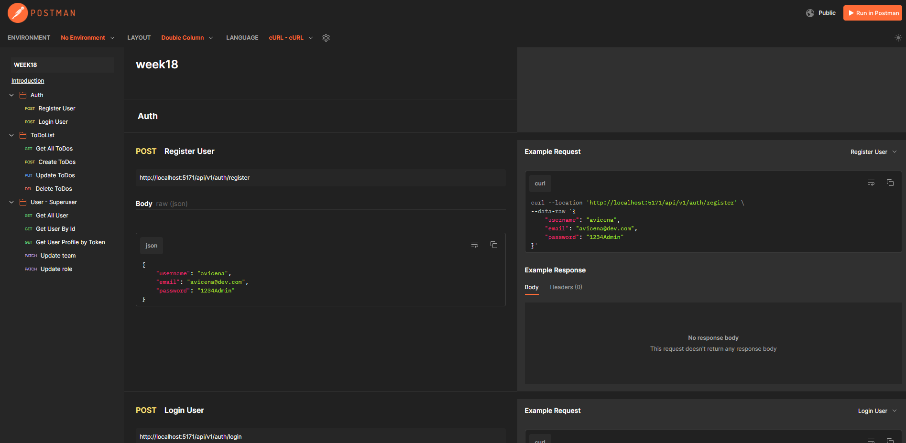
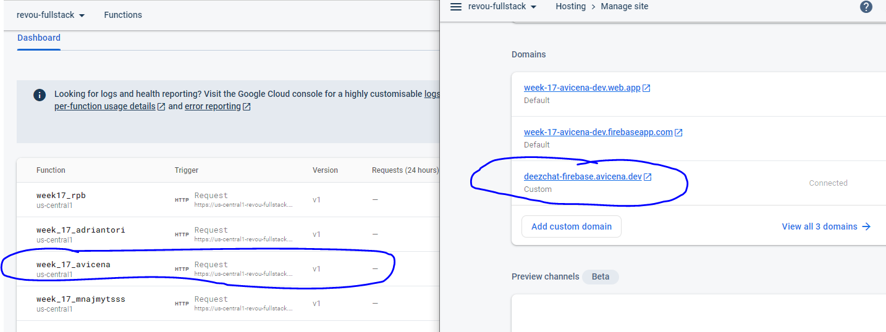

<h1 align="center">Fancy to see you here  </h1>

hi, I'm Muhammad Avicena. In this repo, I build a ToDo-List App with React-Vite, MUI, MongoDB, Node-Express, Implemented RBAC, Advanced Security, & Firebase Deployment. If you have any question or feedback, hit me up at anytime !

I am committed to staying up-to-date with industry trends and using the latest tools to develop innovative solutions that surpass expectations.
Interested to have collaboration ? Find me on:

[](https://www.linkedin.com/in/muhammad-avicena/)
[](https://www.youtube.com/@MuhammadAvicena)
[](https://www.instagram.com/ryuhideaki.dev/)
[](mailto:cenarahmant.dev@gmail.com)

## INGREDIENTS I USE 📜

- WebClient (Web)
  - React
  - MUI
- WebServer (Functions)
  - Node.js
  - Express.js
  - JWT for Role-Based Access Controll
  - MongoDB
- API Documentation
  - Mock Collection API Postman

## HOW TO SET UP 📰

You will need a github account to clone this repository, make sure you're connected to github.

```bash
# Clone this repository or simply fork it.

- git clone https://github.com/RevoU-FSSE-2/week-18-muhammad-avicena.git

# Install depedencies

- npm install

# Set up the .env file, follow the template from `.env.example`.

  # PORT
  PORT=5001

  ## Database connection
  DB_PROD=
  DB_DEV=
  DB_NAME=

  ## JWT Sign
  JWT_SIGN=

# Run the application

- npm run start
- npm run dev
```

## AVAILABLE API 📰

**Endpoint :** [https://us-central1-todolist-app-f1db6.cloudfunctions.net/week_18_avicena](https://us-central1-todolist-app-f1db6.cloudfunctions.net/week_18_avicena)



## DEPLOYMENT APP IN FIREBASE⚙️



The project has been successfully deployed using Firebase. You can access the production version of the website by following this link: [https://task-management.avicena.dev](https://task-management.avicena.dev).

Feel free to explore the website and try out the different features. I appreciate any feedback and suggestions to further improve the user experience.
